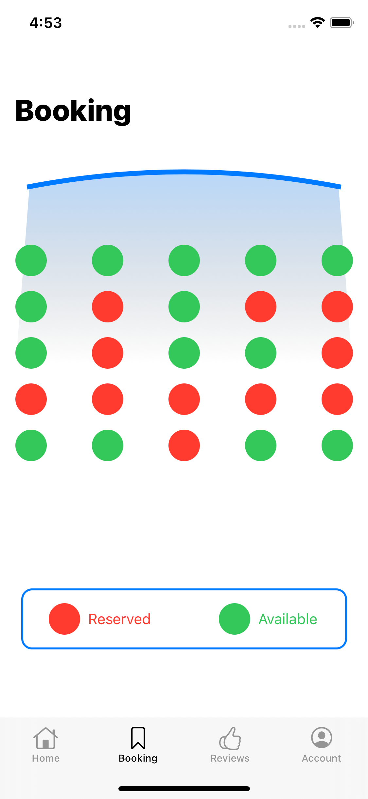

# Umbrella


[](http://ettorezamponi.github.io)


<p float="left">
  
   
  
</p>

&nbsp;

The application for the management of a bathing establishment was created with the idea of providing an additional service to modernise and, above all, speed up the experience between the user and the bathing establishment itself. 
That is, it wants to propose intuitive solutions to users through a simple interface that is always at hand and ready to use.

In detail, the application offers a complete overview of the establishment and the services it makes available to bathers, so that they can get to know it even before they come into contact with it.

## Getting Started

These instructions will get you a copy of the project up and running on your local machine for development and testing purposes. See deployment for notes on how to deploy the project on a live system.

### Prerequisites

The things you need before installing the software.

* Xcode
* CocoaPods

### Installation

A step by step guide that will tell you how to get the development environment up and running.

Install cocoapods, in the main directory:
```
pod install
```
Or update them:
```
pod update
```

Build and run the application chosing the properly the simulator.

## Deployment

* Authentication & DataBase: Firebase
* XCode: 12
* iOS/iPadOS 13.0

## Future Implementation

- Update the dependancy
- Completely new UI
- New Icon
- Why not approach the App Store?

### Documentation

In the documents folder you can find the [Bachelor's Thesis Degree](src="documents/Tesi-Zamponi.pdf") related to this work.

